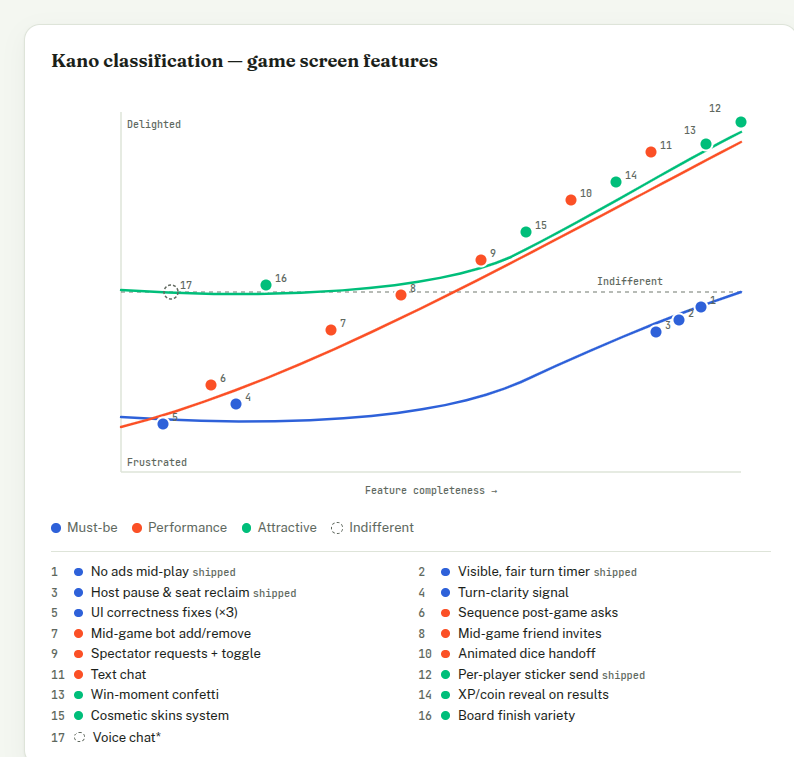
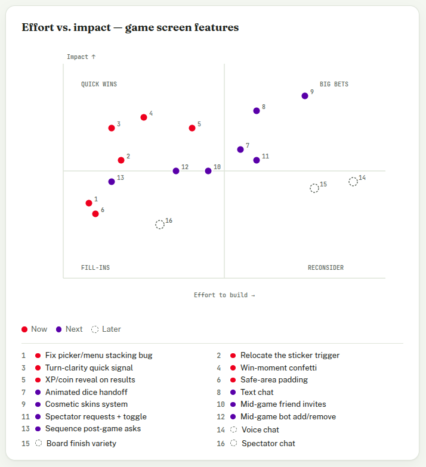

# Roadmap

_Last updated 2026-09-02._

## Current release

- Google Play Billing live for the Android TWA — Game Pack / Game Pass, monthly and annual as separate products.
- Flash-discount splash + trophy leveling system (Home) shipped.
- Home nav item + mobile bottom tab bar added; global `viewport-fit=cover` safe-area fix landed — not yet applied inside the live game screen itself (see #20).

## Next: the game screen

Tracked as issues #15–#30.

